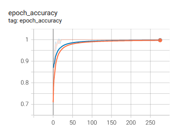

# Heart Disease Prediction Prediction using FNN

## 1. Summary
The aim of this project is to create an accurate deep learning model to predict heart disease (risk level of heart disease). The model is trained with dataset from [Heart Disease Dataset](https://www.kaggle.com/datasets/johnsmith88/heart-disease-dataset)

## 2. IDE and Framework
This project is created using Sypder as the main IDE.  The main frameworks used in this project are Pandas, Numpy, Scikit-learn and Tensorflow Keras.

## 3. Methadology
### 3.1. Data Pipeline
The data is first loaded and preprocessed, such that unwanted features are removed, and label is encoded in one-hot format. Then the data is split into train-validation-test sets, with a ratio of 70:30.

### 3.2. Model Pipeline
A feedforward neural network is constructed that is catered for classification problem. The structure of the model is fairly simple. Figure below shows the structure of the model.

The model is trained with a batch size of 128 and 1000 epochs. Early stopping is also applied in the model training. The training stops at epoch 275, with a training accuracy of 100% and validation accuracy of 99%. The two figures below shows the graph of the training process.

 

## 4. Results
Upon evaluating the model with test data, the model obtaing the following test results, as shown in  figure below.

